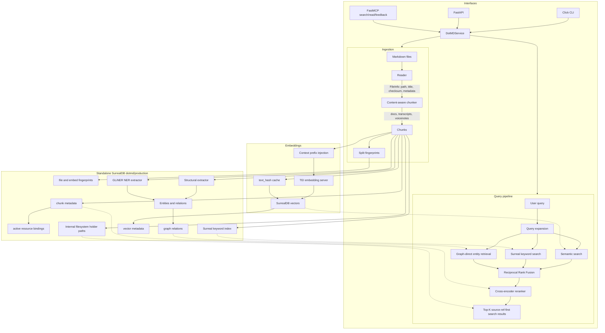

# dotMD Architecture

dotMD is a local markdown retrieval service exposed through a CLI, REST API,
and MCP server. The current production architecture uses standalone SurrealDB
for metadata, keyword retrieval, vector retrieval, and graph-backed entity
retrieval. SQLite/sqlite-vec/FTS5/FalkorDB/LadybugDB are retired, and any
`index.db`/SQLite wording refers to temporary cutover debt scheduled for
removal.

## Pipeline Flowchart

## Pipeline Stages

### 1. Ingestion

- Reader discovers markdown files and extracts file metadata.
- Chunker chooses a split strategy based on content shape:
  - headings for regular docs
  - speaker turns for meeting transcripts
  - paragraphs for voicenotes
- Split fingerprints and embed fingerprints are tracked separately, so changing an embedding model does not force re-chunking.
- An exclusive `fcntl.flock` prevents parallel indexing.

### 2. Storage

| Store | Technology | Contents |
|-------|------------|----------|
| Metadata | SurrealDB | Chunks, source documents, active resource bindings, M2M file paths, index stats |
| Keyword | SurrealDB indexes | Keyword index with title/tag weighting semantics |
| Vector | SurrealDB HNSW | Embeddings keyed by chunk strategy and embedding model |
| Graph | SurrealDB relations | Files, sections, entities, tags, and relations |
| Feedback | SurrealDB | Agent feedback submissions |

The schema is two-dimensional where needed: `(chunk_strategy, embedding_model)`. This lets multiple chunking strategies and embedding models coexist in one index.

### 3. Embeddings

- TEI is the normal embedding runtime.
- Document title/context is prepended at encode time where configured.
- `text_hash` enables embedding reuse across compatible chunk strategies.
- SurrealDB stores vectors alongside document metadata and graph relations.

### 4. Extraction and Graph

- Structural extraction handles headings, tags, wikilinks, markdown links, and frontmatter-derived signals.
- GLiNER NER can add named entities when `DOTMD_EXTRACTION__DEPTH=ner`.
- SurrealDB relations are the graph backend.

### 5. Query Pipeline

1. Query expansion prepares the user query for retrieval.
2. Three engines run as peers:
   - semantic vector search through SurrealDB HNSW
   - SurrealDB keyword search
   - graph-direct entity retrieval
3. Reciprocal Rank Fusion combines candidate lists.
4. Cross-encoder reranking rescores the fused candidate pool.
5. Results return public source refs, snippets, fused scores, engine matches,
   and optional heading paths. Filesystem holder paths are internal provenance
   mechanics, not the public read/search identity.
6. Public hydration filters candidates through active resource bindings before
   refs can reach normal `search`, `read(ref)`, or `drill(ref)` output.

### Reranker Adapter Layer

Rerankers implement `RerankerProtocol`: each adapter exposes a stable `name`, a
provider `model_name`, `warmup()`, and `rerank()`. Built-in adapters are
registered by short name. The current production registry contains only
`mmarco-minilm`; historical benchmark candidates are documented outside the
production registry. `RerankerFactory` resolves and caches
the selected adapter so normal search does not construct a model per request.
The current built-in registry does not require Hugging Face custom code; all
remaining adapters keep `trust_remote_code=False`.

`DotMDService` owns all public reranker selection and comparison flows. Normal
search stays single-reranker by default through
`DOTMD_RERANKER_NAME=mmarco-minilm`.
Developer comparison uses `DotMDService.compare_rerankers()`, `GET
/rerank/compare`, or `dotmd rerank compare` to run expansion, retrieval, graph
enrichment, and RRF fusion once, then pass the same shared candidate pool to
multiple adapters. The comparison output includes `elapsed_ms`, human-readable
`elapsed`, cold `load_ms`, hot `rerank_ms`, top chunk ID ordering, scores,
returned counts, per-reranker errors, and overlap diagnostics, sorted by fastest
successful hot rerank time with failures last.
This keeps CPU latency visible without making production serve multiple
rerankers.

No indexes are reloaded per request. Search engines and stores are initialized
with the service and reused; reranker adapters are cached by the factory.

The selected reranker provider is
`cross-encoder/mmarco-mMiniLMv2-L12-H384-v1` via the local
SentenceTransformers CrossEncoder boundary. Phase 20/21 established the staged
benchmark process: latency first, then quality on live Russian/mixed dotMD
queries. `msmarco-minilm` and `mxbai-xsmall-v1` are archived as historical
benchmark evidence, not production candidates. The methodology and current
results live in `docs/reranker-benchmark-methodology.md`.

Reranking is non-fatal. If the provider errors, is unavailable, or an optional
raw-score floor removes all candidates, dotMD falls back to fused semantic,
keyword, and graph ranking instead of returning an empty search result.

## Interfaces

| Interface | Entry point | Notes |
|-----------|-------------|-------|
| CLI | `dotmd.cli` | Thin Click wrapper over `DotMDService` |
| REST API | `dotmd.api.server` | FastAPI app for HTTP clients |
| MCP HTTP | `dotmd mcp --transport streamable-http` | Production container entrypoint |
| MCP stdio | `dotmd mcp` | Per-client subprocess mode |

MCP currently exposes:

| Tool | Description |
|------|-------------|
| `search` | Query the indexed knowledgebase; each hit has `{ ref, heading?, snippet, score }` |
| `read` | Read indexed source content by `read(ref, start, end)` |
| `drill` | Inspect source metadata with `drill(ref)` |
| `feedback` | Submit agent feedback |

## Operational Constraints

- Do not reload indexes per request; stores are initialized once and reused.
- Do not run `dotmd index --force` while the production container is running; trickle holds the indexing lock.
- Source is bind-mounted in production, so code changes take effect after container restart. Rebuild only when dependencies or entrypoint files change.
- Batch small production changes and restart once.

## Future Source Adapters

Phase 25 introduced a filesystem Markdown compatibility shim as the first
source-aware slice. Phase 26 made the public contract source-ref-first:
filesystem documents map to `namespace = filesystem`,
`document_ref = str(Path(file_path).resolve())`, and
`ref = filesystem:<document_ref>`. Public MCP search hits now expose
`{ ref, heading?, snippet, score }`; agents call `drill(ref)` for source
metadata and `read(ref, start, end)` for chunk text.

`source_documents` and `chunk_source_provenance_<strategy>` provide the public
ref provenance. `Chunk.file_paths` and `chunk_file_paths_<strategy>` remain
internal filesystem/content-dedup holder mechanics for discovery, local file
reads, delete detection, and content-addressed chunk sharing. They are not the
public search/read identity.

Current graph `File` nodes are internal filesystem provenance records. Future
Telegram dialogs/messages must not be modeled as `File`; new non-filesystem
sources should use `SourceDocument` and `SourceUnit` semantics instead.

No Phase 26 step required `dotmd index --force`. A full rebuild remains a
three-day cost/risk item that requires an explicit user decision.

Phase 27 adds the retained artifact lifecycle boundary for filesystem Markdown.
An active resource binding is now the public visibility gate. `source_documents`
remains the source of truth for active/current document metadata and
fingerprints; `resource_bindings` records whether a resource is active plus the
retained content and metadata fingerprint snapshots used for equivalent rebind
lookup. Retained inactive artifacts are hidden from normal public `search`,
`read(ref)`, and `drill(ref)` and are retained only for reuse, not as a recycle
bin or inactive browsing surface.

Filesystem missing paths deactivate their binding instead of doing the normal
hard purge, preserving chunks, provenance, FTS rows, vector rows, and graph
artifacts for possible reuse. Modified files still use replacement reindex
semantics and update active binding fingerprints after successful reindex.
Garbage collection and TTL policy are deferred. No Phase 27 step required
`dotmd index --force`, a full reindex, or a full rebuild.

Phase 27 is foundation only. Telegram ingestion, a structured `mcp-telegram`
export API, attachments/media, generic plugin UI, Telegram deleted-upstream
metadata policy, and live Telegram smoke remain later-phase work.

Phase 28 adds the reusable application-source provider contract for future
non-filesystem sources. The generic method set is `describe_source`,
`export_changes`, and `read_unit_window`; `export_changes` carries
`SourceDocument` and `SourceUnit` together. dotMD persists `checkpoint_cursor`
only after local persistence succeeds, while `next_cursor` is not durable
progress by itself. `SourceUnit` is the provider-owned recomputation boundary,
with source-unit fingerprints making replayed active records idempotent.
Delete/hidden/tombstone lifecycle policy remains deferred from the common
contract. The Phase 29 Telegram boundary is captured in
[mcp-telegram Source Contract](mcp-telegram-source-contract.md). No Phase 28
step requires `dotmd index --force` or a full rebuild.

The intended future direction is source/document/unit ingestion where
filesystem files are only one source adapter. The design context and open
questions for Telegram, Notion, Google Docs, Perplexity, ChatGPT/Claude
exports, source assets, entity catalogs, source state, and source-aware
chunking are captured in
[Source Adapter Architecture Context](source-adapter-architecture.md). The
follow-up expert-panel review is captured in
[Source Adapter Architecture Expert Panel Review](source-adapter-architecture-panel-review.md).
