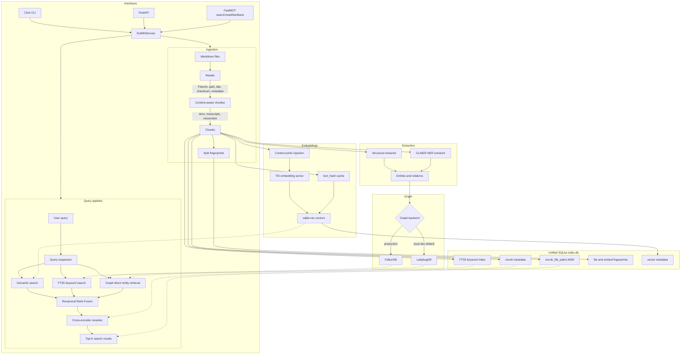

# dotMD Architecture

dotMD is a local markdown retrieval service exposed through a CLI, REST API, and MCP server. The current architecture uses a unified SQLite index for metadata, FTS5, fingerprints, and sqlite-vec vectors, plus a graph backend for entity-aware retrieval.

## Pipeline Flowchart

## Pipeline Stages

### 1. Ingestion

- Reader discovers markdown files and extracts file metadata.
- Chunker chooses a split strategy based on content shape:
  - headings for regular docs
  - speaker turns for meeting transcripts
  - paragraphs for voicenotes
- Split fingerprints and embed fingerprints are tracked separately, so changing an embedding model does not force re-chunking.
- An exclusive `fcntl.flock` prevents parallel indexing.

### 2. Storage

| Store | Technology | Contents |
|-------|------------|----------|
| Metadata | SQLite `index.db` | Chunks, file metadata, M2M file paths, index stats |
| Keyword | SQLite FTS5 | Incremental keyword index with title/tag weighting |
| Vector | sqlite-vec in `index.db` | Embeddings keyed by chunk strategy and embedding model |
| Graph | FalkorDB or LadybugDB | Files, sections, entities, tags, and relations |
| Feedback | SQLite `feedback.db` | Agent feedback submissions |

The schema is two-dimensional where needed: `(chunk_strategy, embedding_model)`. This lets multiple chunking strategies and embedding models coexist in one index.

### 3. Embeddings

- TEI is the normal embedding runtime.
- Document title/context is prepended at encode time where configured.
- `text_hash` enables embedding reuse across compatible chunk strategies.
- sqlite-vec avoids the AVX2 dependency that made LanceDB fragile on older CPUs. LanceDB remains a legacy optional backend.

### 4. Extraction and Graph

- Structural extraction handles headings, tags, wikilinks, markdown links, and frontmatter-derived signals.
- GLiNER NER can add named entities when `DOTMD_EXTRACT_DEPTH=ner`.
- FalkorDB is the production graph backend.
- LadybugDB remains the embedded local-dev default.

### 5. Query Pipeline

1. Query expansion prepares the user query for retrieval.
2. Three engines run as peers:
   - semantic vector search through sqlite-vec
   - SQLite FTS5 keyword search
   - graph-direct entity retrieval
3. Reciprocal Rank Fusion combines candidate lists.
4. Cross-encoder reranking rescores the fused candidate pool.
5. Results return chunk IDs, snippets, fused scores, engine matches, heading paths, and all file paths attached to the content-addressed chunk.

### Reranker Adapter Layer

Rerankers implement `RerankerProtocol`: each adapter exposes a stable `name`, a
provider `model_name`, `warmup()`, and `rerank()`. Built-in adapters are
registered by short names such as `qwen3-0.6b`, `msmarco-minilm`,
`mmarco-minilm`, `gte-multilingual`, and `bge-v2-m3`; `RerankerFactory` resolves and caches
the selected adapter so normal search does not construct a model per request.
Models that require Hugging Face custom code opt in through the registry entry
only; `gte-multilingual` sets `trust_remote_code=True`, while other built-ins
keep remote code disabled.

`DotMDService` owns all public reranker selection and comparison flows. Normal
search stays single-reranker by default through `DOTMD_RERANKER_NAME=qwen3-0.6b`.
Developer comparison uses `DotMDService.compare_rerankers()`, `GET
/rerank/compare`, or `dotmd rerank compare` to run expansion, retrieval, graph
enrichment, and RRF fusion once, then pass the same shared candidate pool to
multiple adapters. The comparison output includes `elapsed_ms`, human-readable
`elapsed`, top chunk ID ordering, scores, returned counts, per-reranker errors,
and overlap diagnostics, sorted fastest successful reranker first with failures
last.
This makes Qwen CPU latency visible without making production serve multiple
rerankers.

No indexes are reloaded per request. Search engines and stores are initialized
with the service and reused; reranker adapters are cached by the factory.

The selected reranker provider is `Qwen/Qwen3-Reranker-0.6B` via the local
SentenceTransformers CrossEncoder boundary. The choice came from public
benchmark, publication-age, and deployment-fit research, not a local dotMD eval
harness: Qwen3 0.6B is fresh enough for May 2026 default selection,
multilingual, text-only, and lighter than the Qwen3-VL reranker family.
ContextualAI rerank-v2 and Jina v3 remain credible alternates if Qwen serving or
latency fails; older GTE/BGE models are fallback-only because publication age
disqualifies them from being the default despite easier integration.

Reranking is non-fatal. If the provider errors, is unavailable, or an optional
raw-score floor removes all candidates, dotMD falls back to fused semantic,
FTS5, and graph ranking instead of returning an empty search result.

## Interfaces

| Interface | Entry point | Notes |
|-----------|-------------|-------|
| CLI | `dotmd.cli` | Thin Click wrapper over `DotMDService` |
| REST API | `dotmd.api.server` | FastAPI app for HTTP clients |
| MCP HTTP | `dotmd mcp --transport streamable-http` | Production container entrypoint |
| MCP stdio | `dotmd mcp` | Per-client subprocess mode |

MCP currently exposes:

| Tool | Description |
|------|-------------|
| `search` | Query the indexed knowledgebase |
| `read` | Read indexed file content by chunk range |
| `feedback` | Submit agent feedback |

## Operational Constraints

- Do not reload indexes per request; stores are initialized once and reused.
- Do not run `dotmd index --force` while the production container is running; trickle holds the indexing lock.
- Source is bind-mounted in production, so code changes take effect after container restart. Rebuild only when dependencies or entrypoint files change.
- Batch small production changes and restart once.
